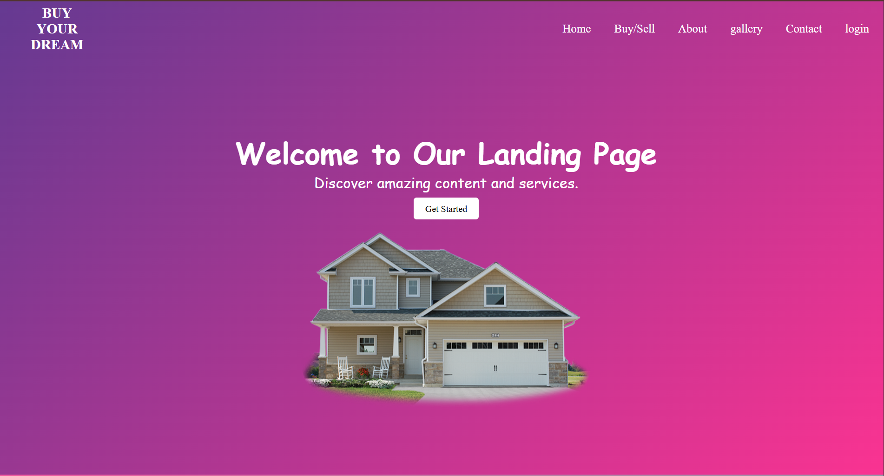
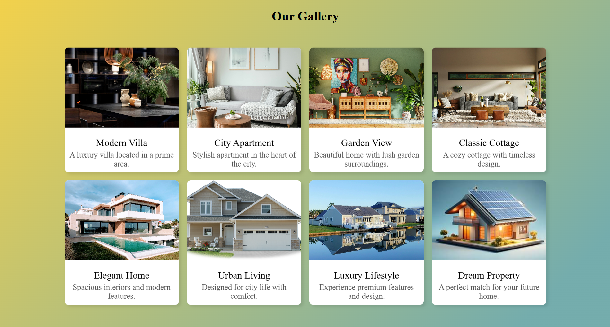
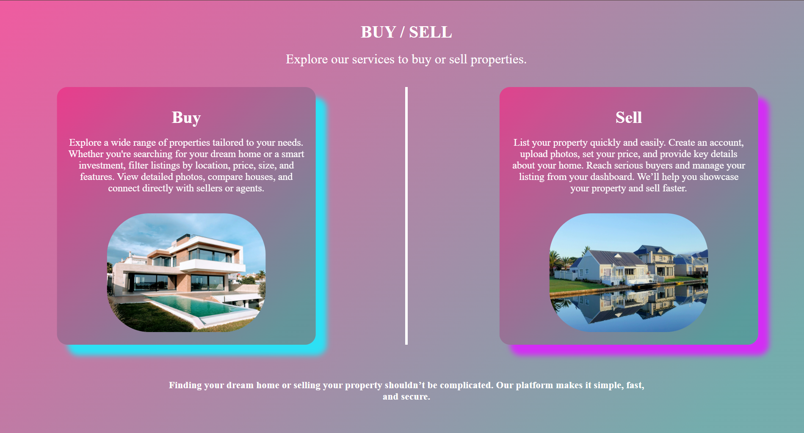

# 🏠 Buy Your Dream

A modern **landing page website** for buying and selling houses.  
The project is designed to give a real-estate look and feel with multiple sections/pages such as landing, gallery, buy & sell, and login.

---

## 🌟 Features
- Responsive landing page design
- Gallery page to showcase properties
- Buy & Sell page for easy property listings
- Login page for user access
- Clean and modern UI

---

## 📸 Screenshots

### Landing Page


### Gallery Page


### Buy & Sell Page


### Login Page


---

## 🛠️ Tech Stack
- **HTML5**
- **CSS3**
- **JavaScript**

---

## 📁 Project Structure

```
TASK1/
├── screenshots/
│   ├── home.png
│   ├── gallery.png
│   ├── buy_sell.png
│   └── login.png
├── index.html
├── gallery.html
├── buy_sell.html
├── login.html
├── style.css
├── script.js
└── README.md
```

---

## 🎨 Features Overview

### Landing Page
- Hero section with property showcase
- Navigation menu
- Featured properties section
- Contact information

### Gallery
- Property image gallery
- Filter and search functionality
- Property details display

### Buy & Sell
- Property listing forms
- Search and filter options
- Property comparison features

### Login
- User authentication interface
- Registration form
- Password recovery options

---

## 📱 Responsive Design
- Desktop optimized
- Tablet friendly
- Mobile responsive

---

## 👨💻 Author

**Dharanishankar**
- GitHub: [@dharani043](https://github.com/dharani043)
- LinkedIn: [Dharanishankar S](https://www.linkedin.com/in/dharanishankar-s-bb20ba290/)
- Email: dharanishankar118@gmail.com

---