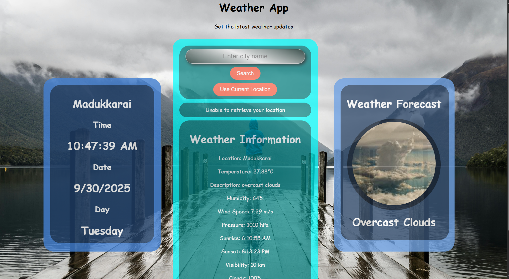
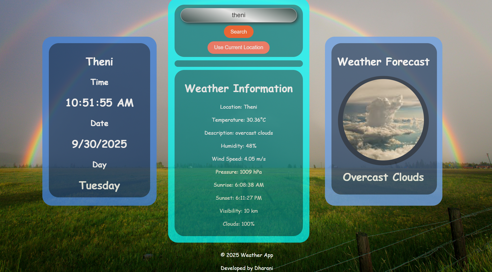

# 🌦️ Weather App

A simple and interactive **Weather App** that shows real-time weather updates for any city.  
This project demonstrates how to fetch live data from a weather API and display it in a clean UI.

---

## 🚀 Features
- Search weather by city name
- Use current location for weather data
- Display temperature, humidity, and weather conditions
- Dynamic weather icons based on conditions
- Real-time date and time display
- Dynamic background images
- Responsive design for desktop and mobile
- Weather forecast visualization

---

## 📸 Screenshots

### Main Weather Interface


### Weather Search Results


---

## 🛠️ Tech Stack
- **HTML5**
- **CSS3** 
- **JavaScript (ES6+)**
- **OpenWeatherMap API**

---

## 📁 Project Structure

```
TASK2/
├── images/
│   ├── clear night.jpg
│   ├── cloudy.jpg
│   ├── drizzle.jpg
│   ├── foggy.jpg
│   ├── hazy.jpg
│   ├── misty.jpg
│   ├── rainy.jpg
│   ├── smoky.jpg
│   ├── snowy.jpg
│   ├── stormy.jpg
│   ├── sun.jpg
│   ├── sun+.jpg
│   ├── sunny.jpg
│   ├── thunder rain.jpg
│   ├── web1.jpg
│   ├── web2.jpg
│   ├── web3.jpg
│   ├── web4.jpg
│   └── web5.jpg
├── weather.html
├── style.css
├── script.js
└── README.md
```

---

## ⚡ Key Features

### Weather Information Display
- Current temperature in Celsius
- Weather description
- Humidity percentage
- Wind speed
- Atmospheric pressure
- Sunrise and sunset times
- Visibility distance
- Cloud coverage percentage

### Interactive Elements
- City search functionality
- Current location detection
- Dynamic weather icons
- Random background images
- Real-time clock

### Responsive Design
- Mobile-friendly interface
- Tablet optimization
- Desktop layout

---

## 🔧 API Integration
Uses OpenWeatherMap API for:
- Current weather data
- Location-based weather
- Weather condition mapping

---

## 📱 Browser Support
- Chrome (latest)
- Firefox (latest)
- Safari (latest)
- Edge (latest)

---

## 👨💻 Author

**Dharanishankar**
- GitHub: [@dharani043](https://github.com/dharani043)
- LinkedIn: [Dharanishankar S](https://www.linkedin.com/in/dharanishankar-s-bb20ba290/)
- Email: dharanishankar118@gmail.com

---