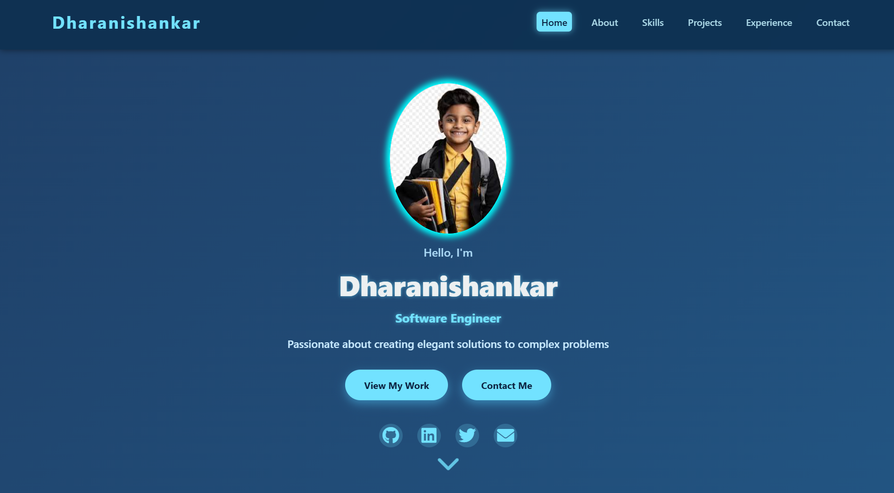
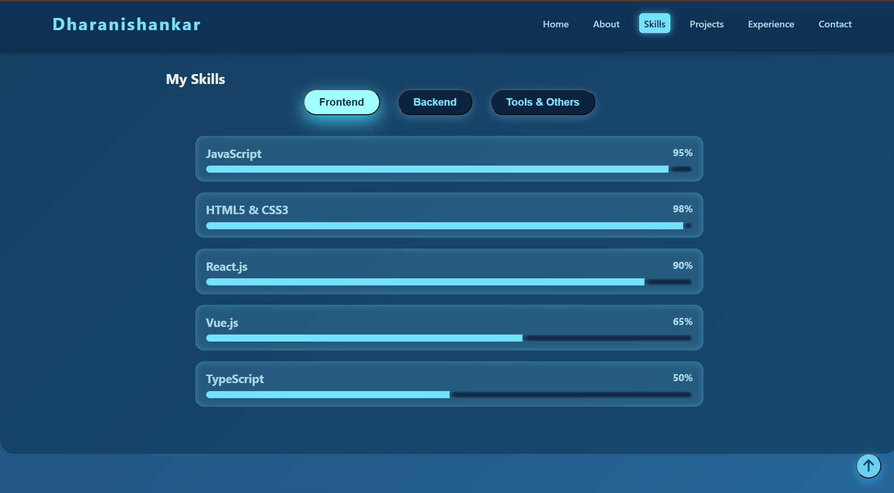
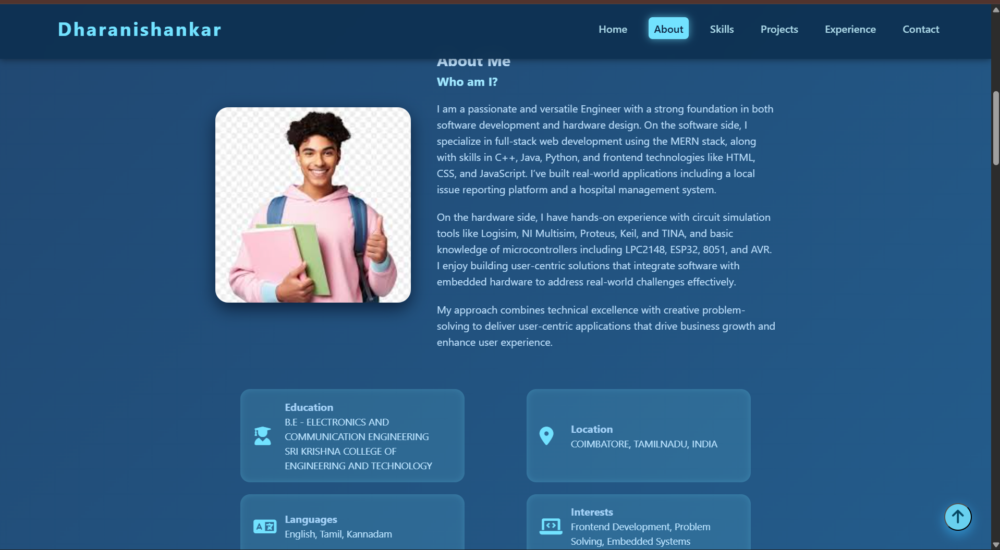

# 🚀 Personal Portfolio Website

A modern, responsive personal portfolio website showcasing my skills, projects, and experience as a Software Engineer.

---

## 🌟 Features

- **Responsive Design**: Optimized for desktop, tablet, and mobile devices
- **Interactive Navigation**: Smooth scrolling with active section highlighting
- **Skills Showcase**: Tabbed interface displaying frontend, backend, and tools expertise
- **Project Portfolio**: Filterable project gallery with live demos and source code links
- **Contact Form**: Functional contact form with validation
- **Modern UI/UX**: Clean design with smooth animations and hover effects
- **Accessibility**: ARIA labels and keyboard navigation support

---

## 📸 Screenshots

### Desktop View


### Skills Section


### Projects Portfolio


---

## 🛠️ Tech Stack

- **Frontend**: HTML5, CSS3, JavaScript (ES6+)
- **Styling**: Custom CSS with Flexbox and Grid
- **Icons**: Font Awesome 6.0
- **Fonts**: Segoe UI, Tahoma, Geneva, Verdana
- **Animations**: CSS Keyframes and Transitions


## 📁 Project Structure

```
TASK3/
├── images/
│   ├── client1.jpg
│   ├── client2.jpg
│   ├── client3.jpg
│   └── client4.jpg
├── screenshot/
│   ├── p1.png
│   ├── p2.png
│   └── p3.png
├── index.html
├── styles.css
├── script.js
└── README.md
```

---

## 🎨 Customization

### Personal Information
Update the following in `index.html`:
- Name and profession in the hero section
- About me content
- Skills and proficiency levels
- Project details and links
- Contact information

### Styling
Modify `styles.css` to:
- Change color scheme (primary colors: `#72e2ff`, `#0c2340`)
- Update fonts and typography
- Adjust animations and transitions
- Modify responsive breakpoints

### Functionality
Enhance `script.js` to:
- Add new interactive features
- Integrate with backend services
- Add form submission handling
- Implement additional animations

---

## 📱 Responsive Breakpoints

- **Desktop**: > 900px
- **Tablet**: 600px - 900px
- **Mobile**: < 600px

---

## 🔧 Browser Support

- Chrome (latest)
- Firefox (latest)
- Safari (latest)
- Edge (latest)

---

## 📈 Performance Features

- Optimized images and assets
- Smooth scrolling and animations
- Lazy loading for better performance
- Minimal JavaScript for fast loading

---

## 🤝 Contributing

1. Fork the repository
2. Create your feature branch (`git checkout -b feature/AmazingFeature`)
3. Commit your changes (`git commit -m 'Add some AmazingFeature'`)
4. Push to the branch (`git push origin feature/AmazingFeature`)
5. Open a Pull Request

---

## 📄 License

This project is licensed under the MIT License - see the [LICENSE](LICENSE) file for details.

---

## 👨‍💻 Author

**Dharanishankar**
- GitHub: [@dharani043](https://github.com/dharani043)
- LinkedIn: [Dharanishankar S](https://www.linkedin.com/in/dharanishankar-s-bb20ba290/)
- Email: dharanishankar118@gmail.com

---

## 🙏 Acknowledgments

- Font Awesome for the beautiful icons
- Inspiration from modern portfolio designs
- Thanks to the open-source community

---

⭐ **If you found this project helpful, please give it a star!**